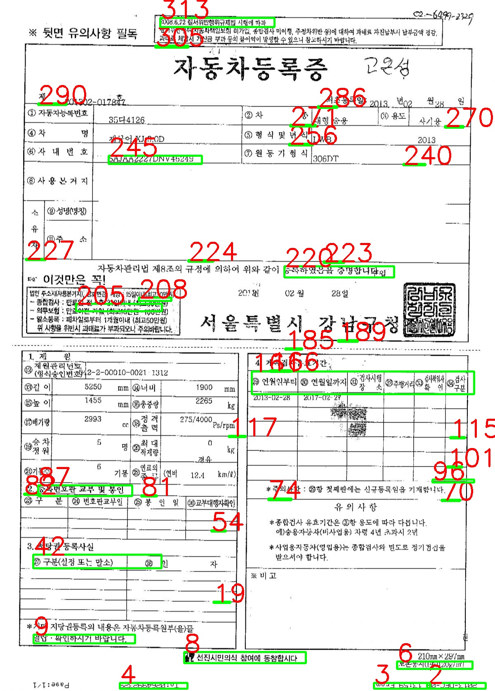

# Detect Box and Predict VIN-Number using Tensorflow
This repo is for Detecting box and to Predict VIN-Number based on 'Neural Network' methods. Use CNN Models and Use OpenCV package for detection.  

The project folder structure is as follows.  
```bash
$ tree -N -L 3
.
├── blackbox.py
├── blackbox_sample.jpg
├── cnn-example
│   ├── checkpoints
│   ├── cnn-example.py
│   ├── cnn-summary.md
│   ├── mnist_data
│   └── mnist_graph
├── core
│   ├── __pycache__
│   ├── common.py
│   └── model.py
├── main.py
├── preprocessing.py
├── requirements.txt
├── res
│   ├── box
│   ├── char
│   ├── model_checkpoint
│   ├── sample1_blackboxed.jpg
│   └── sample2_blackboxed.jpg
└── tmp
    ├── Fnt
    ├── Fnt.zip
    ├── box
    ├── sample1.jpg
    ├── sample2.jpg
    └── sample3.jpg
13 directories, 15 files
```

## How to use
### install packages  
```bash
$ pip install -r requirements.txt
```

### Start Blackbox Tutorial
```bash
$ python main.py
[Detect VIN Num Using BlackBox Algorithm]
Usage:
******************************************
****** 1) CNN Tutorial                  **
****** 2) Blackbox Tutorial             **
****** 3) Train model                   **
****** 4) Test model                    **
******************************************
Select Number:
```


#### 1) CNN Tutorial
```bash
$ python main.py
[Detect VIN Num Using BlackBox Algorithm]
Usage:
******************************************
****** 1) CNN Tutorial                  **
****** 2) Blackbox Tutorial             **
****** 3) Train model                   **
****** 4) Test model                    **
******************************************
Select Number: 1
```  
When the code is executed, the `mnist_data`, `mnist_graph`, `checkpoints` folders are created. It stores each mnist
data and learning results.


#### 2) Blackbox Tutorial
You can test the blackbox algorithm . How to use is as follows:  
```bash
$ python main.py
[Detect VIN Num Using BlackBox Algorithm]
Usage:
******************************************
****** 1) CNN Tutorial                  **
****** 2) Blackbox Tutorial             **
****** 3) Train model                   **
****** 4) Test model                    **
******************************************
Select Number: 2
```  
In addition to sample1.jpg, the result is created in the `res/{file_name}_blackbox.jps` after execution with other jpg.  



#### Preprocess Data
Preprocess the training data using `preprocess.py`. Data needed for pre-processing is moved to `tmp/box` and executed.
```bash
$ python preprocessing.py
 [INFO] sample1.png preprocess finished!
 [INFO] sample3.png preprocess finished!
 [INFO] sample2.png preprocess finished!
```
or,  
```bash
$ ./preprocessing.py
 [INFO] sample1.png preprocess finished!
 [INFO] sample3.png preprocess finished!
 [INFO] sample2.png preprocess finished!
```

Data needed for learning is stored in a folder with the file name in the `res / char` folder.  
```bash
$ ll res/
total 1304
drwxr-xr-x   7 jj  staff     224  5 23 21:21 ./
drwxr-xr-x  12 jj  staff     384  5 23 22:20 ../
drwxr-xr-x   5 jj  staff     160  1 25 00:44 box/
drwxr-xr-x   5 jj  staff     160  5 10 15:08 char/
drwxr-xr-x   6 jj  staff     192  1 27 17:45 model_checkpoint/
-rw-r--r--   1 jj  staff  619795  5 23 21:41 sample1_blackboxed.jpg
```

#### Train Model & Prediction
**Train Model:**  
For model training, Enter Num `3`. Instructions to train is as follows:  
```bash
$ python main.py train {epoch: number} {batch_size: number}
```
or,  
```bash
$ ./main.py train {epoch: number} {batch_size: number}
```

**Prediction:**  
For prediction, use `main.py`. Instructions to predict is as follows:  
```bash
$ python main.py test
[PREDICT]: I [TARGET]: res/char/sample2/sample2_6.png
[PREDICT]: Q [TARGET]: res/char/sample2/sample2_7.png
[PREDICT]: P [TARGET]: res/char/sample2/sample2_5.png
[PREDICT]: F [TARGET]: res/char/sample2/sample2_4.png
[PREDICT]: H [TARGET]: res/char/sample2/sample2_0.png
[PREDICT]: N [TARGET]: res/char/sample2/sample2_1.png
[PREDICT]: S [TARGET]: res/char/sample2/sample2_3.png
[PREDICT]: M [TARGET]: res/char/sample2/sample2_2.png
[PREDICT]: B [TARGET]: res/char/sample2/sample2_15.png
[PREDICT]: 5 [TARGET]: res/char/sample2/sample2_14.png
[PREDICT]: B [TARGET]: res/char/sample2/sample2_16.png
[PREDICT]: Z [TARGET]: res/char/sample2/sample2_13.png
[PREDICT]: S [TARGET]: res/char/sample2/sample2_12.png
[PREDICT]: A [TARGET]: res/char/sample2/sample2_10.png
[PREDICT]: Z [TARGET]: res/char/sample2/sample2_11.png
[PREDICT]: R [TARGET]: res/char/sample2/sample2_9.png
[PREDICT]: B [TARGET]: res/char/sample2/sample2_8.png
```
or,  
```bash
$ ./main.py test
[PREDICT]: I [TARGET]: res/char/sample2/sample2_6.png
[PREDICT]: Q [TARGET]: res/char/sample2/sample2_7.png
[PREDICT]: P [TARGET]: res/char/sample2/sample2_5.png
[PREDICT]: F [TARGET]: res/char/sample2/sample2_4.png
[PREDICT]: H [TARGET]: res/char/sample2/sample2_0.png
[PREDICT]: N [TARGET]: res/char/sample2/sample2_1.png
[PREDICT]: S [TARGET]: res/char/sample2/sample2_3.png
[PREDICT]: M [TARGET]: res/char/sample2/sample2_2.png
[PREDICT]: B [TARGET]: res/char/sample2/sample2_15.png
[PREDICT]: 5 [TARGET]: res/char/sample2/sample2_14.png
[PREDICT]: B [TARGET]: res/char/sample2/sample2_16.png
[PREDICT]: Z [TARGET]: res/char/sample2/sample2_13.png
[PREDICT]: S [TARGET]: res/char/sample2/sample2_12.png
[PREDICT]: A [TARGET]: res/char/sample2/sample2_10.png
[PREDICT]: Z [TARGET]: res/char/sample2/sample2_11.png
[PREDICT]: R [TARGET]: res/char/sample2/sample2_9.png
[PREDICT]: B [TARGET]: res/char/sample2/sample2_8.png
```

You can check whether the prediction was successful by checking the TARGET file name.


---

made by *jaejun.lee*  
